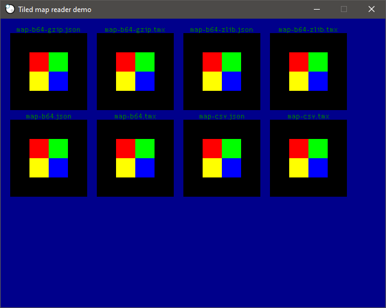

# tiled-sphere
A library for loading [Tiled](mapeditor.org/) XML and JSON maps to be used by the [Sphere game engine](https://github.com/fatcerberus/sphere)'s build tool, cell.

## Usage
This doesn't really do anything interesting yet. It currently just parses a specific map file for testing and prints out some info about it for debugging purposes. When both XML and JSON map and tileset files can be parsed reliably, I'll start working on being able to render them in the Sphere game engine so that they can also be used elsewhere.

## Screenshot
Here's a screenshot of it loading and rendering a simple map saved with different encodings and compressions. A more interesting screenshot will (hopefully) come soon.

## Tiled support
 * Supported map formats: tmx (xml), json
 * Supported layer formats: base64, csv
 * Supported layer compression formats: gzip, zlib

Layer compression isn't required, and the tiled-sphere library should be able to detect if it isn't necessary.

## Attribution
[xml.js](cell/tiled/xml.js) was originally developed by [Bruce Pascoe](https://github.com/fatcerberus/) for neoSphere (with a couple small modifications by me), but is no longer in development.

The [Sphere 2.x API definition file](types/sphere2-api.d.ts) was also developed by Bruce Pascoe.
